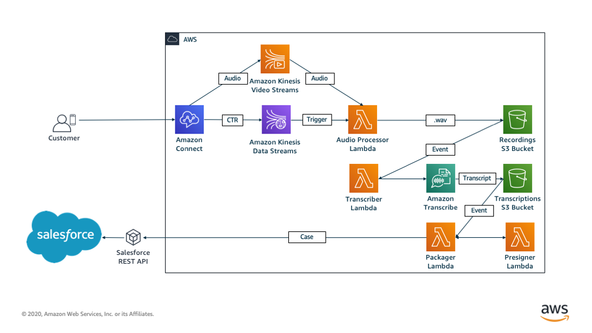

## NOTE: New Version of Voicemail Express ##
A new version of Voicemail Express has been released with significant changes. We have left this version in place as a reference for users that have deployed it, however all new implementations should use the new [Voicemail Express V2 Solution](../../Solutions/VMX2-VoicemailExpress/readme.md).

# Voicemail Express
Voicemail Express is designed to provide basic voicemail capability to Service Cloud Voice customers. With the service resrictions of the Service Cloud Voice provisioned AWS account, the typical voicemail solution for Amazon Connect is not an option. As an alternative, Voicemail Express was designed to provide similar functionality relying on events in various AWS Services and on objects in Salesforce.

With Voicemail Express, customers can have the option to leave a voicemail for an agent or queue. Once the voicemail is recorded, a series of processes take place that ultimately result in:
1. Voicemail stored in S3 as a .wav file
2. Transcription of the voicemail
3. Presigned URL that provides access to the voicemail from Salesforce without the need for authentication into AWS.
4. A new case in Salesforce that includes the transcription, link to the voicemail recording, and a clickable callback number for ease of response.

Voicemails in this solution are configured for a lifecycle of up to 7 days. After 7 days, the recordings are deleted and the presigned URL is no longer valid. During deployment, you have the option to reduce this lifecycle window, if desired. Once the recording is deleted, the generated case will still maintain a copy of the transcript for future reference.

To deploy Voicemail express, you will need to complete the following:
**Solution should not be deployed**
