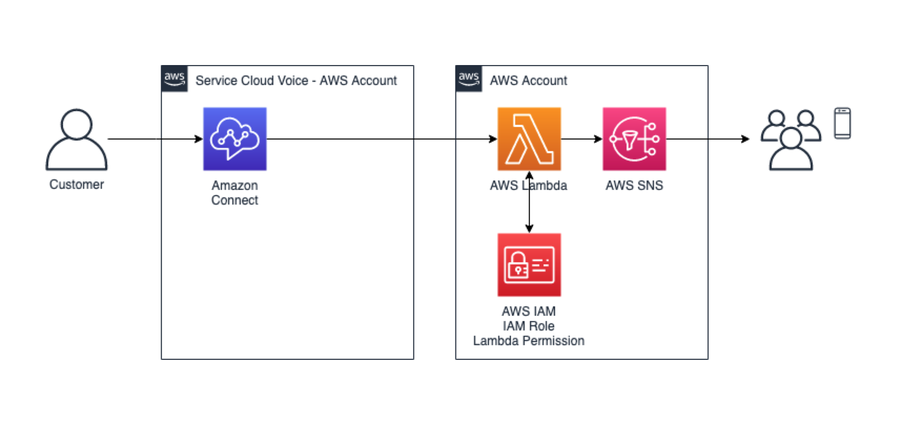

# AWSSCV Cross Account SMS Example

This project shows how to call an AWS Lambda function that exists in a separate account or a separate region using AWS Lambda permissions.  You might want to do this if you want to interact with an AWS service that is not part of the included SCV services.

## Project Components
- CloudFormation template that builds:
  - IAM Role:
  - Lambda Permission: Provides cross account access to the Lambda function
  - Lambda Function:
    - Process the Amazon Connect Lambda call 
    - Send the SMS message
- Amazon Connect Contact Flow
  - Main flow that sends an SMS message to the calling number
    
## Project Requirements
- Operational Salesforce Service Cloud Voice configuration
- Second Amazon Web Services account

## Deployment Steps
1. Launch the Amazon Cloudformation template awsscv_cross_account_sms.yaml in the account and region where your backend infrastructure exists.  THis should be in separate account as the target Service Cloud Voice Amazon Connect instance.
2. The template will ask for two parameters:
   - ConnectInstanceArn - This is the ARN of the target Amazon Connect instance.
   - LambdaLoggingLevel - This is the level at which the Lambda function will log [DEBUG, INFO, WARNING, ERROR, CRITICAL]
3. Launch the stack.  This will create a Lambda function in your source account that can be invoked by the Amazon Connect instance.
4. Navigate to Contact Flows in your Service Cloud Voice Amazon Connect instance.
5. Create a new contact flow
6. Import the SCV-CrossAccountSMS flow in this repo
5. Under the Invoke AWS Lambda function, enter the full ARN of the SendSMS Lambda function.  It will not populate automatically like other AWS Lambda functions.  
6. Publish and test.
