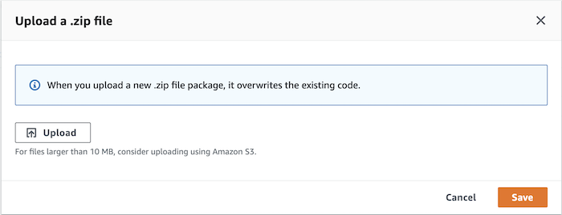
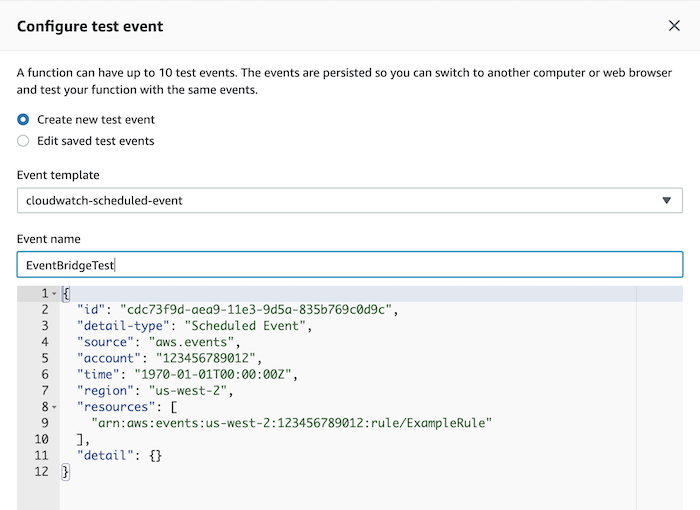
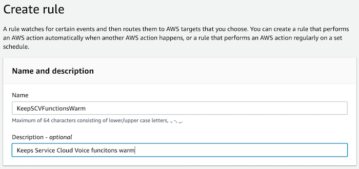
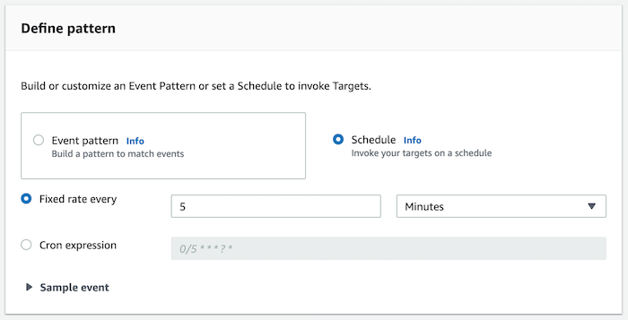
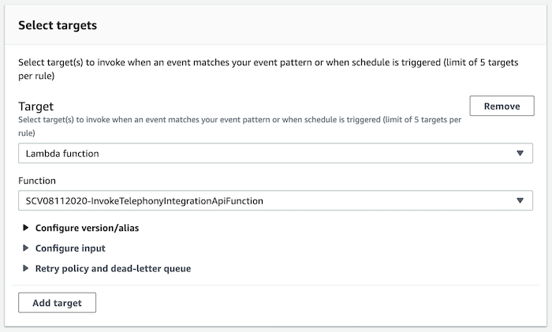

# Keeping Lambda Functions Warm

**NOTE:** Salesforce is in the process of enabling Amazon EventBridge and Amazon Simple Notification Service for Service Cloud Voice created accounts. Please validate service availability before proceeding with this configuration.

When working with Lambda functions in a voice interaction, fast response times are critical. With AWS Lambda, if a funciton has not been used in a while, the resources allocated to it can be redistributed elsewhere. This can cause a delay the next time the function is executed. To prevent this, you can use Amazon EventBridge to periodically call the function, keeping it ready to execute quickly. In this example, we will show you how to modify the existing Salesforce-provided Lambda functions for Service Cloud voice to properly handle Amazon EventBridge events. This modification is NOT NECESSARY for EventBridge to work and to keep your function active, however EventBridge can generate errors as it sends events to your functions that they are not designed to respond to. Since the modification is simple, it is reasonable to just adapt the code to handle the EventBridge events properly and eliminate those errors. 

There are three Salesforce-provided Lambda functions that would benefit most from this modification. They are:
- InvokeTelephonyIntegrationApiFunction
- kvsConsumerTrigger
- kvsTranscriber

**NOTE:** You can set all three functions as targets for one EventBridge rule.

In this example, we will show you how to modify the **InvokeTelephonyIntegrationApiFunction** function. This modification simply looks at the incoming event and determines if it is an EventBridge event. If so, it responds accordingly. If not, it continues to evaluate the existing funciton code. Since the **InvokeTelephonyIntegrationApiFunction** function is written for Node.js, we will use the following code:

````javascript
    // BEGIN AWS modification for EventBridge
    let eventSource = event.source || 'undefined';
    if (eventSource == 'aws.events') {
        result = {'eventStatusCode': 200,'eventResponse' : 'warm', 'eventType' : 'EventBridge'};
        console.log(result)
        return result
    }
    // END AWS modification for EventBridge
````

Essentially, we set the value for `eventSource` to the incoming event value of **source**, if it exists. If this is an EventBridge event, the **source** will be `aws.events`. Once set, we check the valure of eventSource. If it is an EventBridge event, we configure a response, log the response, and return the response. We're using the **result** variable since that is what the Lambda function is configured to use under normal operation. That's it! We insert this code into the function just after the main result variable declaration and it will be ready to respond accordingly. For other functions in other languages, a similar approach can be taken. for example, if the function was in Python, we could do something like:

````python
    # BEGIN AWS modification for EventBridge
    response = {}
    
    if 'source' in event:
        event_source = event['source']
    
        if event_source == 'aws.events':
            response.update({'event_status_code': 200,'event_response' : 'warm', 'event_type' : 'EventBridge'})
            print(response)
            return response
    # END AWS modification for EventBridge
````

Additionally, you could add logic to handle exceptions, other use cases, etc, but fundamentally we just need something that sees the EventBridge event and replies so that we don't continue processing the function.

## Example Components
This example will require the following **modification**
- Update the Lambda function with the appropriate code

This example will require the following **new configuration**
- Amazon EventBridge Rule
    
## Project Requirements
- Operational Salesforce Service Cloud Voice configuration

## Configuration Steps
### Update the Lambda Function
1.  Login to the [AWS Console](https://console.aws.amazon.com/console/home)
2.  Make sure you are in the **same region** as your Amazon Connect instance. You can set the region by expanding the region selector in the upper right and choosing the region
3.  Navigate to the **AWS Lambda console**
4.  Open your existing **InvokeTelephonyIntegrationApiFunction** function
5.  Once the function loads, select **Action** and choose **Export function**

    
    
6.  In the **Export your funciton** window, select **Download deployment package**

    

7.  A zip file of your funciton will be downloaded to your local computer
8.  Extract the ZIP folder contents
9.  In the newly extracted folder, open the **handler.js** file in your preferred editor
10. Add a new line **after** line 9 so that you are just below `let result = {};`
11. Paste the javascript code:
````javascript
    // BEGIN AWS modification for EventBridge
    let eventSource = event.source || 'undefined';
    if (eventSource == 'aws.events') {
        result = {'eventStatusCode': 200,'eventResponse' : 'warm', 'eventType' : 'EventBridge'};
        console.log(result)
        return result
    }
    // END AWS modification for EventBridge
````
12.  Save the **handler.js** file
13.  Rezip the entire folder
14.  Return to the AWS Lambda console
15.  Make sure that you are still on the same function, if not, re-open the **InvokeTelephonyIntegrationApiFunction** function
16.  Scroll to the **Function code** section and select **Action** then choose **Upload a .zip file**

    

17.  In the popup, select **Upload**, select the zip file you just created, and choose **Save**

    

18.  The file will update. Once it has loaded, select the **Test Events** dropdown at the top of the page and choose **Configure test events**
19.  In the **Event template** selection box, choose **Amazon Cloudwatch**
20.  Give the new event a name, such as `EventBridgeTest` and choose **Create**

    

21.  Once the test event is create, make sure it is selected and choose **Test**
22.  Once the test completes, you should receive the following result:
````
{
  "eventStatusCode": 200,
  "eventResponse": "warm",
  "eventType": "EventBridge"
}
````
23.  Lambda setup is complete, next we need to configure the EventBridge Rule

### Creating the EventBridge rule
1.  Login to the [AWS Console](https://console.aws.amazon.com/console/home)
2.  Make sure you are in the **same region** as your Amazon Connect instance. You can set the region by expanding the region selector in the upper right and choosing the region
3.  Navigate to the **Amazon EventBridge console**
4.  Choose Events, then select Create Rule
5.  Provide a name for the Rule, such as `KeepSCVFunctionsWarm`
6.  Provide a description, if desired

    
    
7.  In the **Define pattern** section, select **Schedule**
8.  Set the Schedule options as **Fixed rate** every **5 Minutes**

    
    
9.  Leave the **Select event bus** settings to their defaults
10. In the **Select targets** section, leave **Lambda function** selected, then choose your **InvokeTelephonyIntegrationApiFunction** function from the **Function** dropdown

    
    
11. Select **Create**
12. Your rule is now enabled and will execute every 5 minutes, keeping the function warm
